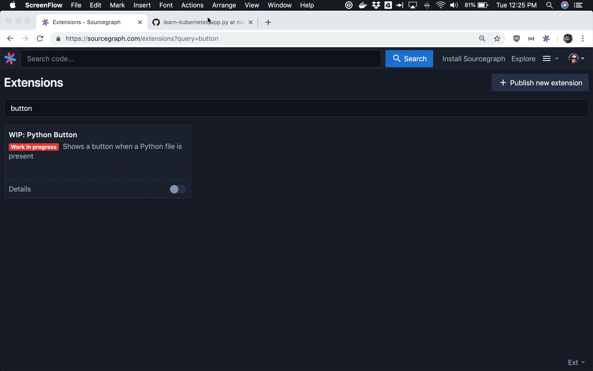

# WIP: Python Button Sourcegraph extension

Displays a button when a Python file is present and when clicked, takes the user to python.org.

When hovering over a Python symbol, one of the [Zen of Python](https://www.python.org/dev/peps/pep-0020/) aphorisms is displayed.

